# Instal·lació i configuració de Moodle amb Ubuntu server

1. Primer actualitzarem els paquets

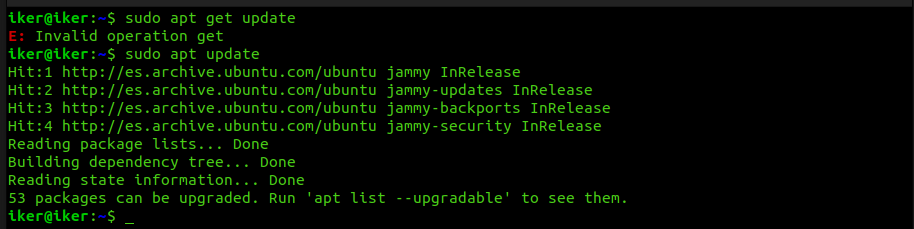

2. Desprès instal·larem apache2

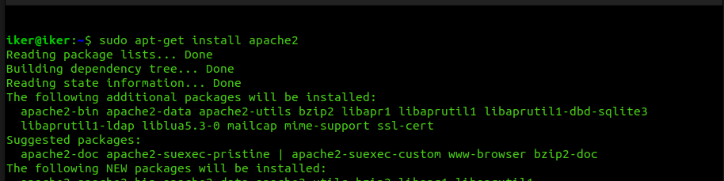

3. Ara instal·larem mariadb

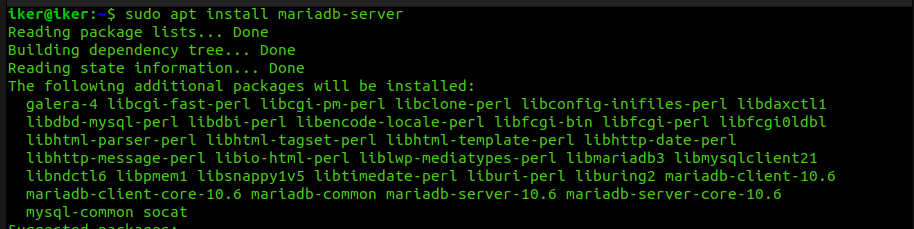

4. Desprès configurarem mysql

## Paràmetres

Aquesta serà la configuració dels paràmetres:

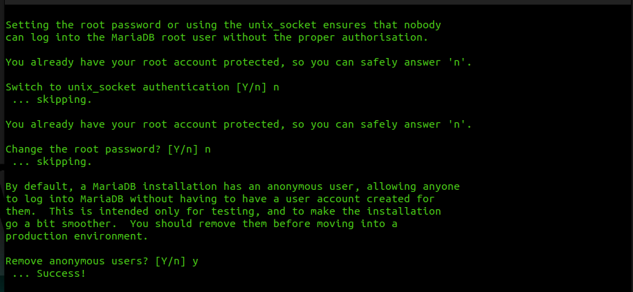

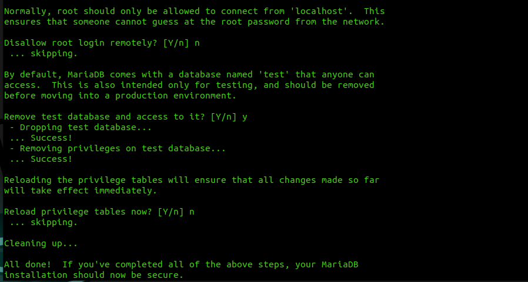

5. Ara afegirem el repositori per descargar PHP

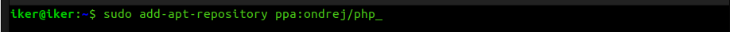

6. Actualitzarem els paquets

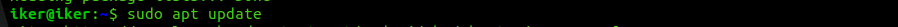

7. Ara instal·larem php7.3

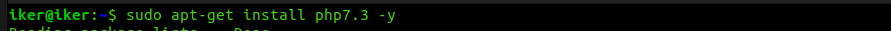

8. Desprès baixarem el fitxer zip de moodle

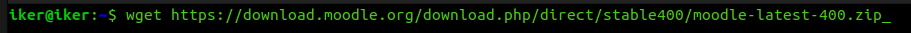

9. Un cop descargat instal·larem unzip i descomprimirem l'arxiu al directori d'apache

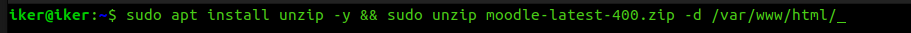

10. Un cop descomprimit posarem permisos publics al directori de moodle

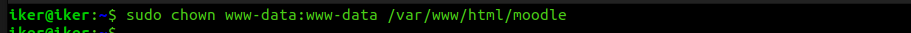

11. Entrarem a la carpeta "home" i crearem una nova carpeta per a moodle on li donarem permisos per als usuaris.

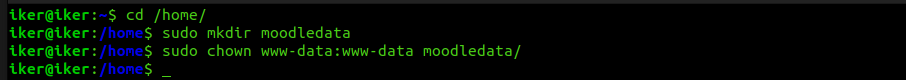

12.  Ara entrarem a MariaDB

13. Posarem un nou usuari amb una contrasenya

14. Crearem una base de dades

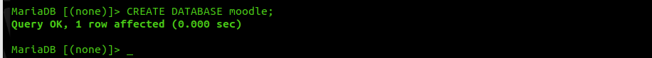

15. Li donarem permisos al usuari que hem creat.

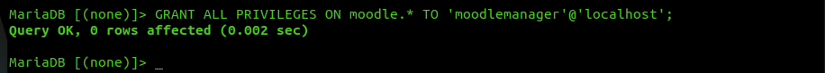

16. Finalment posarem la seguent comanda i sortirem

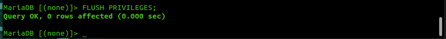

17. Ara accedirem al servidor Moodle a través d'un altra màquina virtual connectada amb adaptador pont.

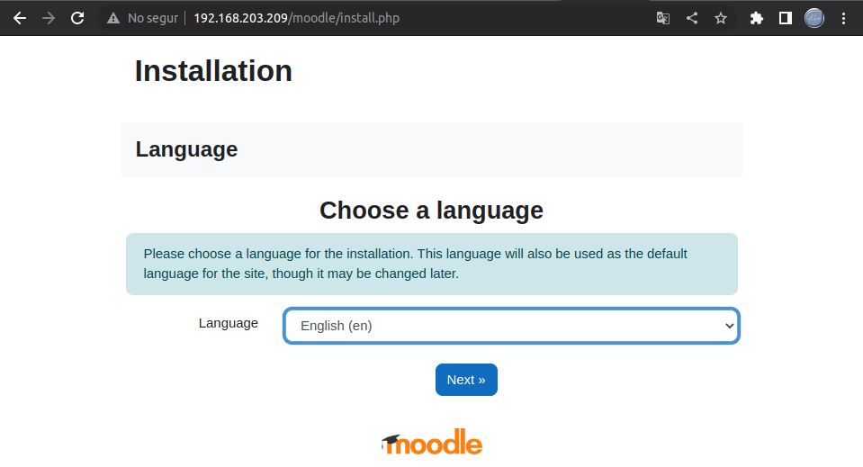

18. ara instal·larem uns paquets que ens demanen

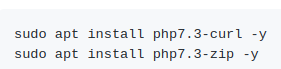

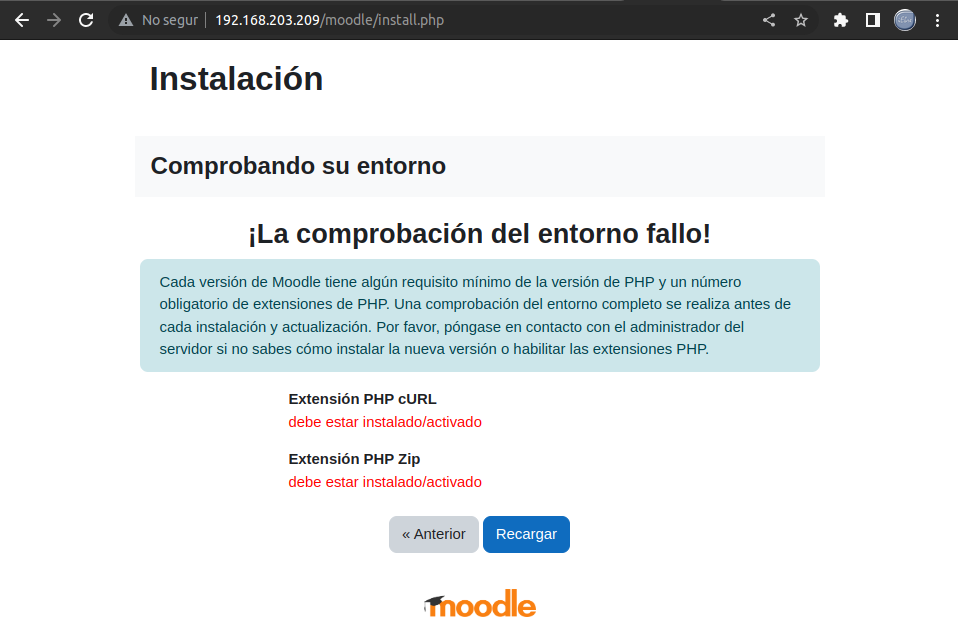

19. Desprès reiniciarem el servidor web.

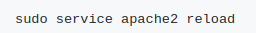

20. Un cop haguem reiniciat veurem aquesta pantalla. Escriurem aquest directori al tercer camp.

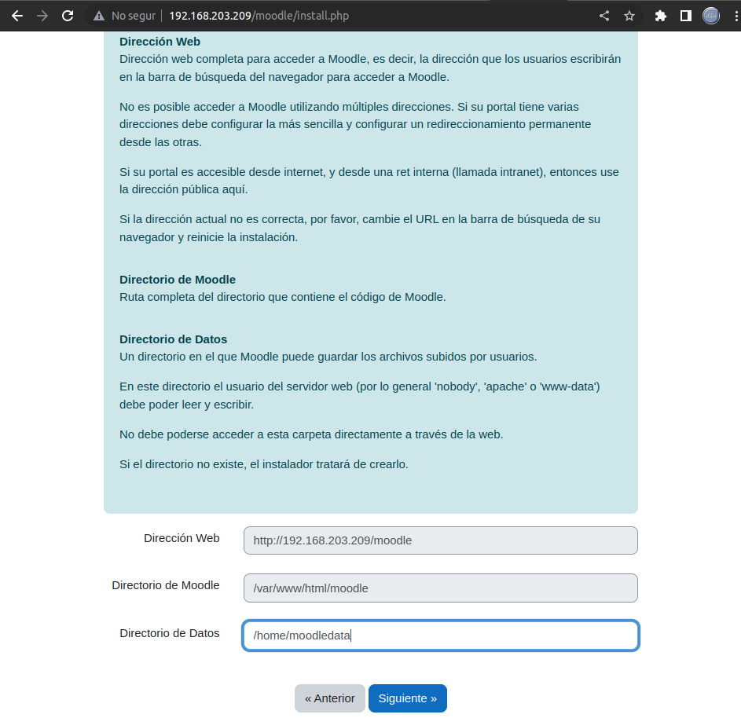

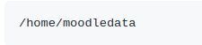

21. Al seguent pas haurem de seleccionar la base de dades MariaDB

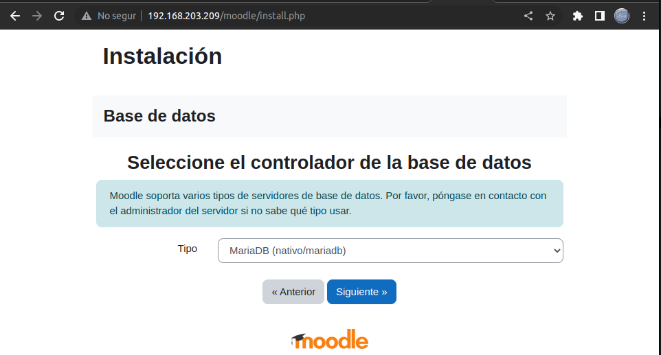

22. Ara emplenarem els camps amb les dades que vam omplir cuan vam configurar la base de dades.

23. Instal·larem els següents paquets

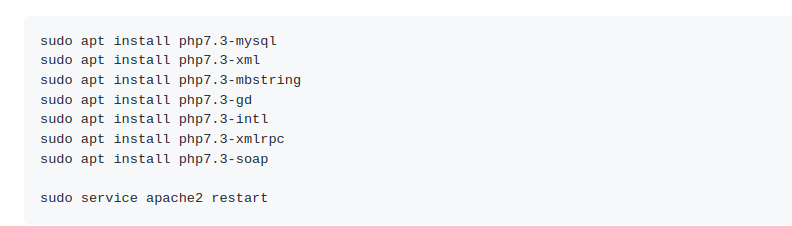

24. Desprès cuan tinguessim la pàgina reiniciada, veurem aquesta pantalla. Li donarem a continuar per acceptar els termes i condicions

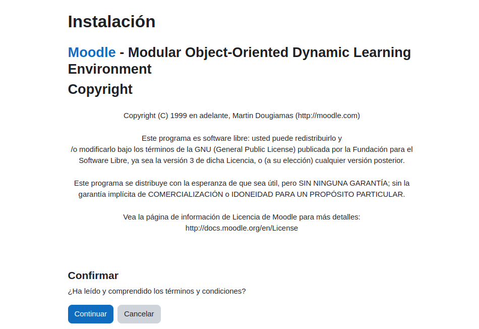

25. Ara ens apareixerà un altra finestra amb tots els arxius

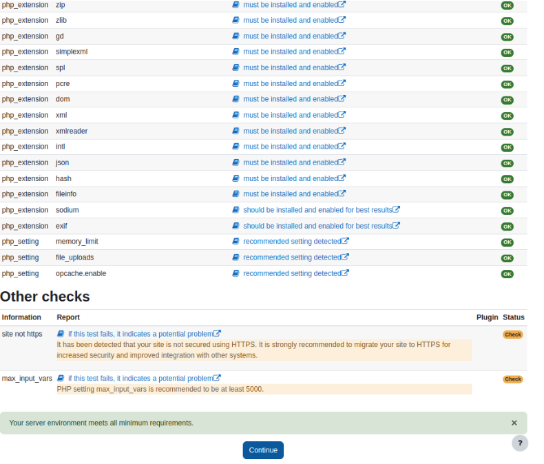

26. Un cop fem clic a continuar s'instal·larà moodle. Un cop finalitzi clicarem continuar

27. Desprès ens sortirà un apartat on posarem les nostres dades personals

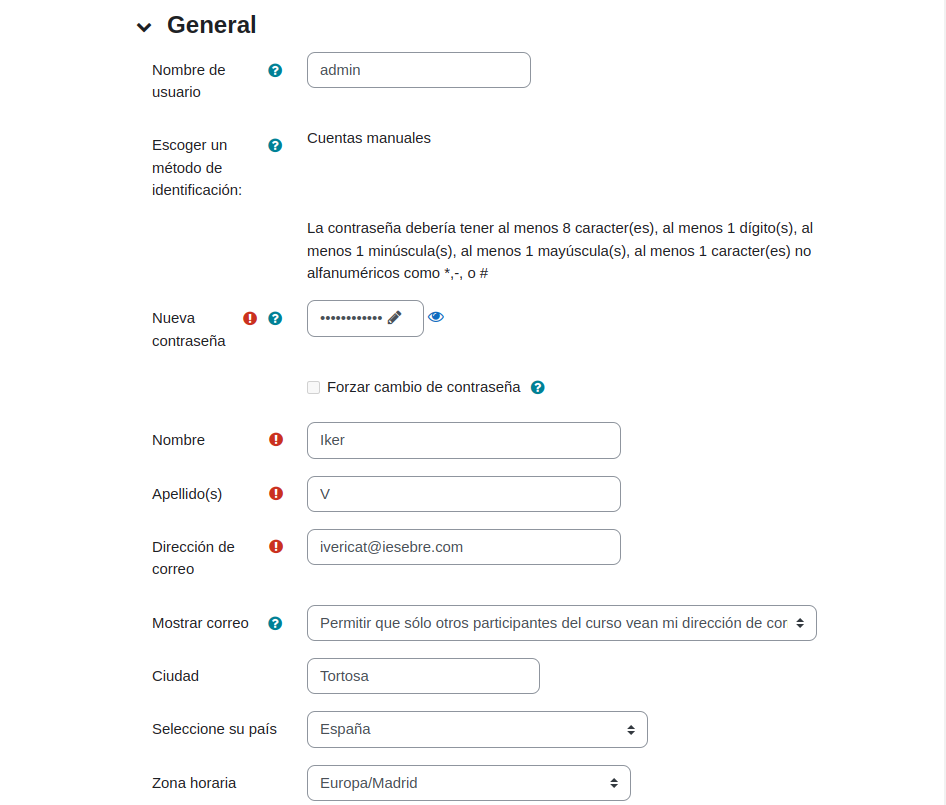

28. ara posarem les dades del nostre moodle

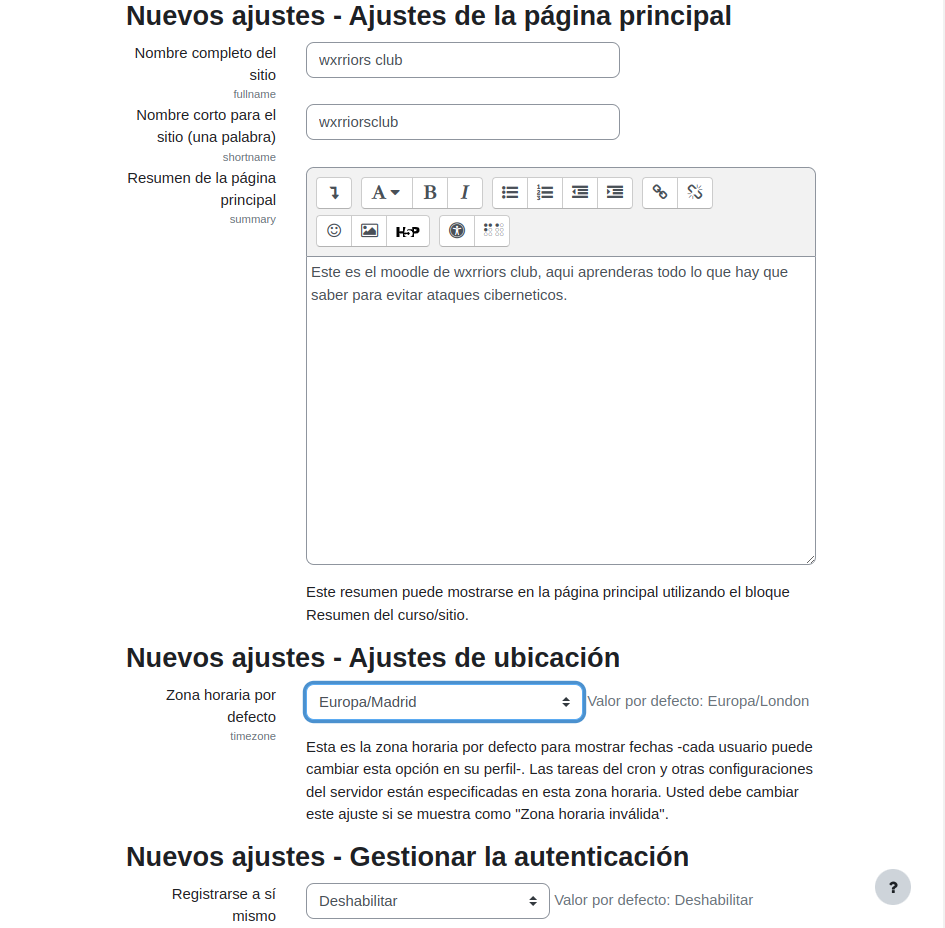

29. Un cop finalitzem els pasos anteriors ja tindrem moodle configurat

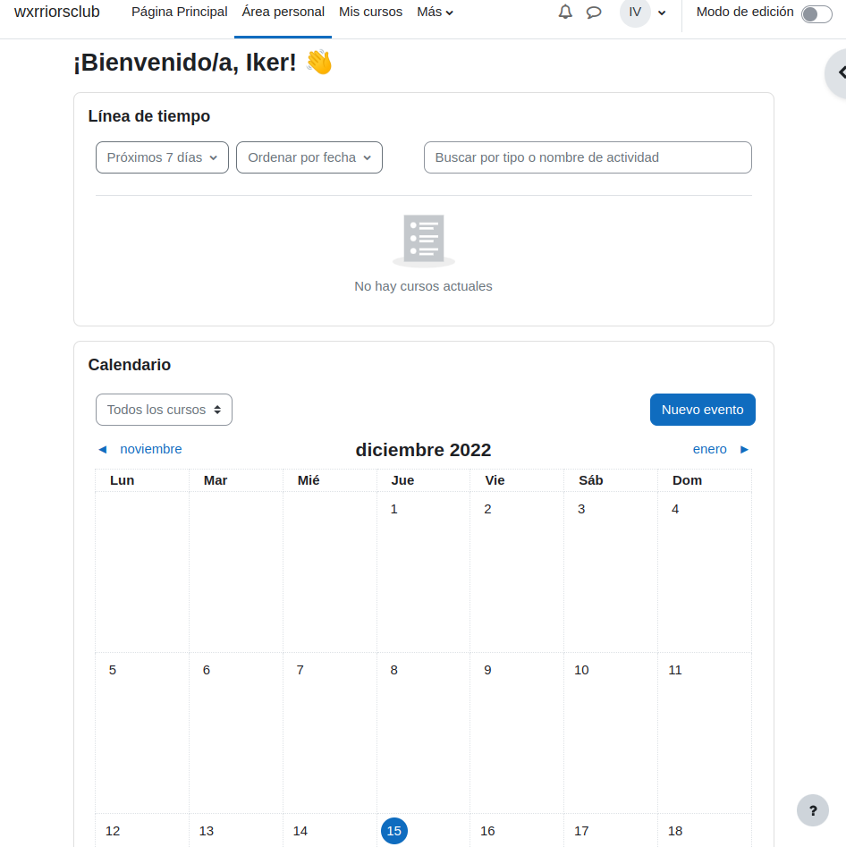

